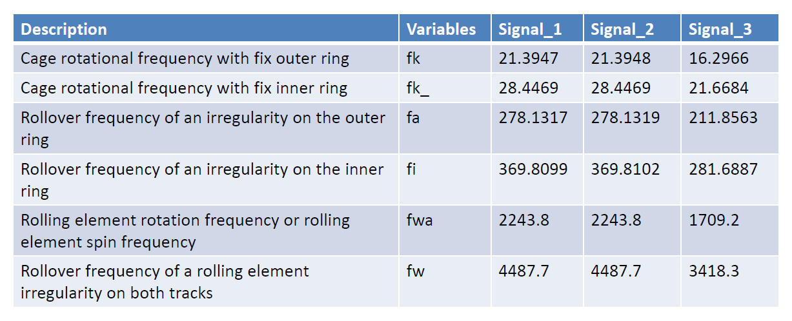

## Damage-Detection-on-Bearing

# Introduction 

In this Project Analysis of three different signals with various signal processing methods was carried out to determine which signals belong to a damaged bearing. hence deciding which kind of damage is Present in the roller Bearing.

# Requirement

* Matlab R2022b
* Signal Processing Tollbox

##Results

## Repository content

* code file
* Dataset
* Results Presentation
